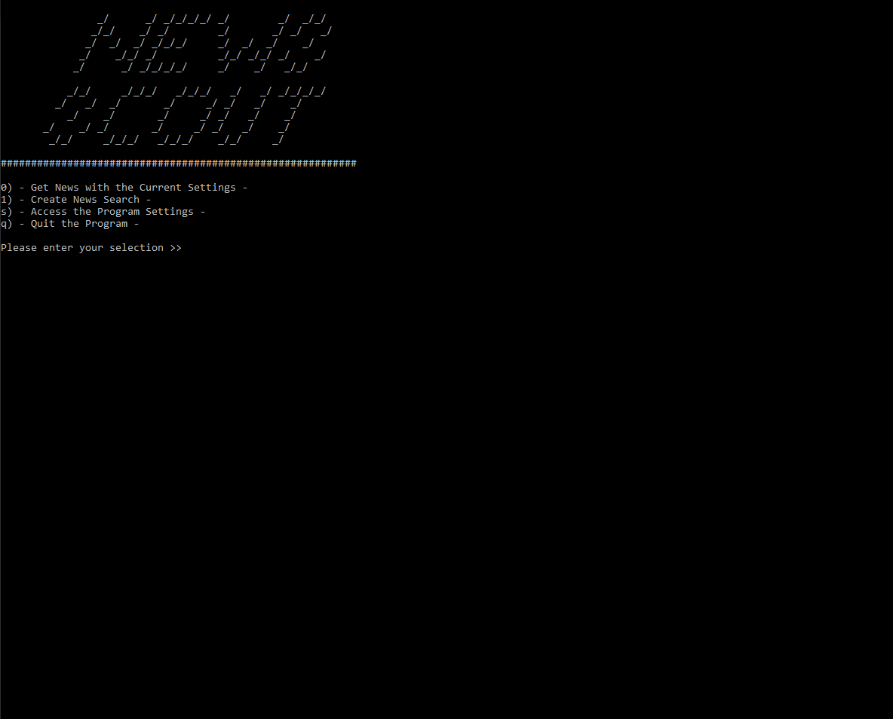
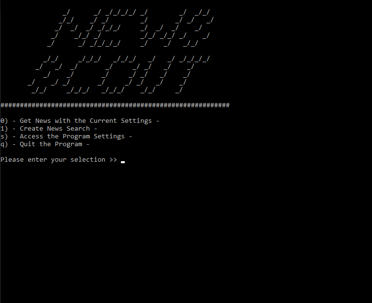

# News Scout

 

Quickly get the latest news in a command line interface. Supports custom search queries, countries of origin and languages.
 
 
<small>
    <b><i>You Like??</i></b>
     
    Show some support!
</small>
 

## :books: Table of Contents
1. [Getting Started](#getting-started)
2. [Usage](#usage)
3. [Settings](#settings)
4. [Contributing](#contributing)
5. [License](#license)

## :mega: Getting Started

To run this program you will need these items:

| Item | Link | As of the Initial Release|
| --- | --- | --- |
| .NET 6 | [Get the latest version](https://dotnet.microsoft.com/en-us/download/dotnet/6.0) | .NET is on v6.0.7 |
| News Data API Key | [Register for a free API Key](https://newsdata.io/register) | Free: API Credits - 200/day, Articles per Credit - 10 |

After installing .NET 6, you can insert the API key into the `settings.json` file that is located in the `Configuration` directory or you can set the API Key in the settings menu after compiling the code.

## :book: Usage

Once the program is run, you can show the latest articles with the current program settings, or you can search through the headlines with a custom search.

## :wrench: Settings

There is a settings menu where you can change the API Key, country of origin and languages. As of right now you can search with up to five countries and languages.

<a name="contributing"><a/>
## :construction: Contributing 

Want to contribute? Please do so by creating a pull request. Be sure to leave a notes detailing your changes.

<a name="license"><a/>
## :page_with_curl: License 

This project is licensed under the MIT License. Check out the [LICENSE.txt](https://github.com/zachsanford/NewsScout/blob/master/LICENSE.txt) file for additional details.
